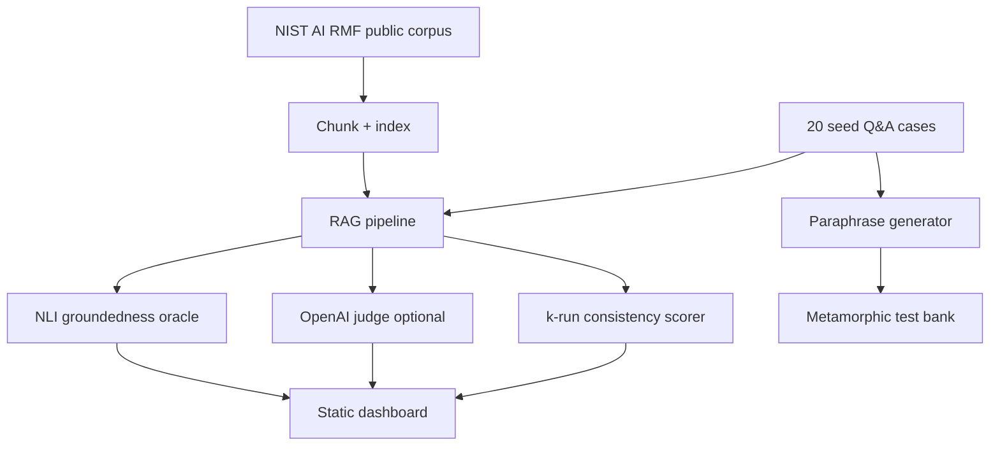

# MetaRAG-Test

Metamorphic and groundedness testing prototype for RAG pipelines. The project uses a public NIST AI Risk Management Framework study corpus, seed Q&A cases, corrupted-context validation, paraphrase invariance checks, consistency scoring, optional OpenAI judging, optional local NLI, and a static dashboard report.

## Research Question

How can automated tests evaluate RAG behavior when answers are non-deterministic, semantically variable, and only correct when grounded in retrieved context?

## Architecture



## Quick Start

```powershell
python -m venv .venv
.\.venv\Scripts\Activate.ps1
pip install -r requirements-ci.txt
pytest
python scripts/run_evaluation.py
```

Open `docs/index.html` after the evaluation run.

For the full stack:

```powershell
pip install -r requirements.txt
$env:OPENAI_API_KEY="<your-openai-api-key>"
$env:OPENAI_MODEL="gpt-5.5"
python scripts/run_evaluation.py --use-openai-answers --include-openai-judge
```

## Metrics

- Groundedness accuracy on clean retrieved context.
- Hallucination catch rate on deliberately corrupted context.
- Flakiness score from k=5 repeated answers.
- Metamorphic violation rate over paraphrased questions.
- Agreement with a RAGAS-style faithfulness proxy.
- Chroma persistence status when optional Chroma dependencies are installed.

## Dataset and IP Boundary

The corpus is public-domain-oriented NIST AI RMF study material and contains no employer code, port data, customer data, or proprietary RAG artifacts. The method, not the domain, is the point of the project.

## Formal Case Study

- [Markdown case study](docs/case-study.md)
- [PDF case study](docs/case-study.pdf)

## Limitations

CI uses lightweight deterministic fallbacks so public tests do not require API keys or heavyweight model downloads. Local runs with OpenAI, Chroma, RAGAS, and NLI models produce stronger empirical comparisons.
